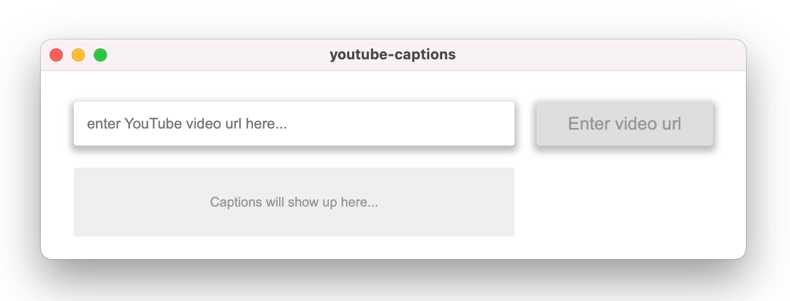

A simple app which simply pulls autogenerated captions from YouTube videos. If use it to automatically decipher videos, so that I can read them before watching, and decide if they're worth of watching. This app is probably an overkill, but I'm a software engineer, so that's a given

Can't believe that I spend 3 hours on building this, just to find out that https://youtubecc.sm-seo.com/ already exists

